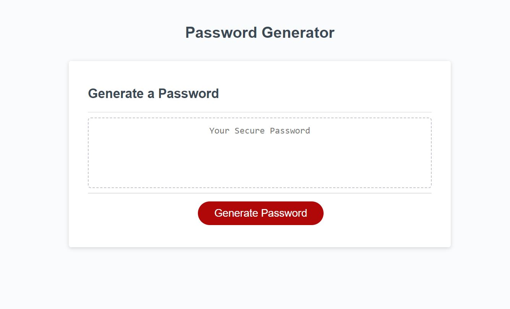

# Random Password Generator

 https://juliaghany.github.io/Random-Password-Generator/

## Description 

- My motivation for this project was to learn how to use JavaScript to create a random password generator for the user. 
- I built this project so that the user can create a random password based on the criteria they choose to include. I also built this project so that I could gain more experience with using JavaScript (variables, functions, if statements, for-loops, etc.) 
- I learned about the prompt() and confirm() methods and how to use them in order to get input from the user. I also learned about Math.floor() and Math.random() and how to use it for this project. I also learned how to use If statements to add value to my passwordBase variable if the user chooses to use a specific type of character in their password. I learned how to use return in order to stop a function from being executed if the user did not include any criteria, or if they chose a number less than 8 or greater than 128 for the character length of their password. I also learned how to use the alert() method to alert the user if they did not include any criteria or choose a number less than 8 or greater than 128. I also gained more experience with logical operators. For example, I used strictly equal (===), the logical AND operator (&&), etc. in my If statements. 
- I got a little carried away once I gained some momentum and started to forget to make commits. You will notice that I removed work and made commits with descriptive commit messages to get into the practice of doing so. I will be better about this in the future as I gain more experience. 
## Usage

- To use this webpage, you will begin by clicking the red "Generate Password" button. After clicking this button, you will see a dialogue box appear at the top center of the webpage. You will then type a number between 8 and 128 to select the number of characters you would like your password to contain and click ok (or hit enter on your keyboard). Next, it will ask you a series of questions: "Would you like to include numbers in your password?", "Would you like to include lowercase letters in your password?", "Would you like to include uppercase letters to your password?", and finally, "Would you like to include special characters to your password?". If the user would like to include any of the characters listed in the previous questions, they can click ok or hit enter on their keyboard to select them. Otherwise, they can click cancel to not include them. The user must select at least one criteria, and the character length of the password must be between 8 and 128 characters, or else they will not have a password generated for them. Once they have gone through each question, the random password generator will display a password in the textbox below that they can use for their new password. 

## Credits 

- I referenced this website and the following artciles for how to use Math.floor(): https://www.geeksforgeeks.org/how-to-select-a-random-element-from-array-in-javascript/ 
- I referenced this website to figure out how to use the alert() method in JavaScript: https://www.w3schools.com/js/js_popup.asp
- I had help from AskBCS (user name: jproodian) to figure out how to use the prompt() method and create a pseudo-code. I ended up going a different route than what we discussed, but I still wanted to credit him here because he really helped me get started on this project. 
- I referenced this website to learn about confirm. I chose to use confirm for majority of my questions on what to include in the password to make it easier for the user (for example, they did not have to type anything in. Instead, they only had to hit ok or cancel to confirm or deny whether or not they wanted certain characters in their password): https://www.w3schools.com/jsref/met_win_confirm.asp
- I referenced 03-JavaSript 07-Ins_Logical-Comparison-Operators to add logical operators to my If statements. 
- I referenced 03-JavaScript 13-Ins_Iteration to create my for-loop. 
- I referenced 04-Web-APIs 15-Ins_Keyboard-Events for how to use +=. We learned in class that you are able to use this (the addition assignment) to add the value of one variable to a new variable. Using If statements, that is how I combined all of the strings in my assignment into one variable named "passwordBase". 
- My tutor, Alexis Gonzalez, helped me figure out what to do for multiple parts of the assignment. He helped me create an empty string for the variable "passwordBase" and helped me understand why that was necessary. He also helped me figure out how/why to add a return to two of my functions so that the user could not move forward without inputing any criteria at all/inputing a number that was less than 8 or greater than 128. He also helped me and taught me how to include the Math.floor() and Math.random() static method. We also referred to these MDN documentations: https://developer.mozilla.org/en-US/docs/Web/JavaScript/Reference/Global_Objects/Math/floor and https://developer.mozilla.org/en-US/docs/Web/JavaScript/Reference/Global_Objects/Math/random. 
- I met with my classmate Eric Drezner and he helped me figure out how to use return generatePassword() to take user to the beginning of the function, that way they didn't have to click the Generate Password button again. 